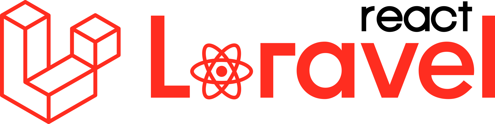

# Qindred

  

  A family tree and connections management application

  

## About Qindred

Qindred is a modern web application that helps families connect, share memories, and maintain their family trees. Built with Laravel and React, it provides a seamless experience for managing family relationships and sharing important moments.

## Features

- Family tree management
- Memory sharing
- Event planning
- Family member connections
- Invitation system

## Technology Stack

- **Backend:** Laravel 10
- **Frontend:** React with Inertia.js
- **Styling:** Tailwind CSS
- **Database:** MySQL/SQLite

## Deployment Status

The application is automatically deployed using GitHub Actions. You can check the deployment status in the badge above.

## Laravel Sponsors

We would like to extend our thanks to the following sponsors for funding Laravel development. If you are interested in becoming a sponsor, please visit the [Laravel Partners program](https://partners.laravel.com).

### Premium Partners

- **[Vehikl](https://vehikl.com)**
- **[Tighten Co.](https://tighten.co)**
- **[Kirschbaum Development Group](https://kirschbaumdevelopment.com)**
- **[64 Robots](https://64robots.com)**
- **[Curotec](https://www.curotec.com/services/technologies/laravel)**
- **[DevSquad](https://devsquad.com/hire-laravel-developers)**
- **[Redberry](https://redberry.international/laravel-development)**
- **[Active Logic](https://activelogic.com)**

## Contributing

Thank you for considering contributing to the Laravel framework! The contribution guide can be found in the [Laravel documentation](https://laravel.com/docs/contributions).

## Code of Conduct

In order to ensure that the Laravel community is welcoming to all, please review and abide by the [Code of Conduct](https://laravel.com/docs/contributions#code-of-conduct).

## Security Vulnerabilities

If you discover a security vulnerability within Laravel, please send an e-mail to Taylor Otwell via [taylor@laravel.com](mailto:taylor@laravel.com). All security vulnerabilities will be promptly addressed.

## License

The Laravel framework is open-sourced software licensed under the [MIT license](https://opensource.org/licenses/MIT).
